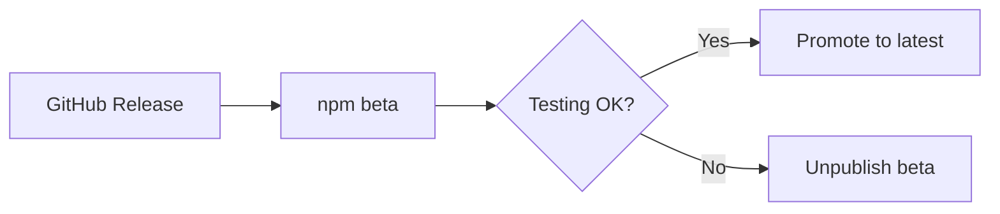

# 📦 npm Publishing Strategy Guide

A comprehensive guide for safely publishing Rust binaries to npm registry using the rust-release action.

## 🎯 Overview

This guide covers how to extend the rust-release workflow to publish your Rust binaries as npm packages, with special focus on **unpublish policies** and **safe deployment strategies**.

## ⚠️ npm Unpublish Policy

### Understanding npm's Restrictions

**Standard Versions (Permanent after 24 hours)**
```
1.0.0, 1.2.3, 2.0.0-stable
```
- Can only be unpublished within **24 hours** of publication
- After 24 hours, requires npm support team intervention (rare exceptions only)
- **High risk** for mistakes or breaking changes

**Prerelease Versions (More Flexible)**
```
1.0.0-beta.1, 1.2.3-alpha.0, 2.0.0-rc.1
```
- **Relatively easier** to unpublish (but still restricted)
- Better for testing and validation
- **Recommended** for initial deployments

## 🏷️ npm Tag System Deep Dive

### System Tags

| Tag | Purpose | Install Command | Unpublish Difficulty |
|-----|---------|----------------|---------------------|
| `latest` | Default stable release | `npm install pkg` | ❌ Very Hard |
| `beta` | Beta testing | `npm install pkg@beta` | ⚠️ Moderate |
| `alpha` | Alpha testing | `npm install pkg@alpha` | ⚠️ Moderate |
| `next` | Next major version preview | `npm install pkg@next` | ⚠️ Moderate |
| `dev` | Development builds | `npm install pkg@dev` | ✅ Easier |
| `experimental` | Experimental features | `npm install pkg@experimental` | ✅ Easier |

### Custom Tags (Recommended for Safety)

```bash
# Create your own safe tags
npm publish --tag canary
npm publish --tag nightly
npm publish --tag preview
npm publish --tag testing
```

**Benefits of Custom Tags:**
- Less visibility = lower risk
- Easier to unpublish
- Clear separation from production

## 🚀 Safe Deployment Strategies

### Strategy 1: Beta-First Approach (Recommended)



**Implementation:**
```yaml
# Always publish to beta first
source_tag: ${{ github.ref_name }}
npm_dist_tag: 'beta'
```

**Promotion Process:**
```bash
# After validation, promote to latest
npm dist-tag add my-package@1.2.3-beta.0 latest
```

### Strategy 2: Staged Release Pattern

```yaml
# GitHub Tag Pattern → npm Version & Tag
v1.2.3-alpha    → 1.2.3-alpha.0  (@alpha)
v1.2.3-beta     → 1.2.3-beta.0   (@beta) 
v1.2.3-rc       → 1.2.3-rc.0     (@next)
v1.2.3          → 1.2.3-beta.0   (@beta)    # Safe first
v1.2.3-stable   → 1.2.3           (@latest) # Direct stable
```

### Strategy 3: Date-Based Prerelease

```yaml
# Time-based versions for maximum safety
1.2.3-dev.20231201    (@dev)
1.2.3-beta.20231205   (@beta)
1.2.3                 (@latest)
```

## 🔧 Workflow Implementation

### Basic npm Publishing Workflow

```yaml
name: npm Publish

on:
  release:
    types: [published]

jobs:
  rust-release:
    uses: xctions/rust-release/.github/workflows/reusable-rust-release.yml@v2
    with:
      binary_name: 'my-cli'
      release-tag: ${{ github.ref_name }}
    secrets:
      GITHUB_TOKEN: ${{ secrets.GITHUB_TOKEN }}

  npm-publish:
    needs: rust-release
    uses: xctions/rust-release/.github/workflows/npm-publish.yml@v2
    with:
      source_tag: ${{ github.ref_name }}
      npm_dist_tag: 'beta'  # Safe deployment
      package_name: 'my-cli'
    secrets:
      NPM_TOKEN: ${{ secrets.NPM_TOKEN }}
```

### Advanced Conditional Publishing

```yaml
npm-publish:
  needs: rust-release
  uses: xctions/rust-release/.github/workflows/npm-publish.yml@v2
  with:
    source_tag: ${{ github.ref_name }}
    npm_dist_tag: ${{ 
      github.ref_name == 'stable' && 'latest' || 
      contains(github.ref_name, 'alpha') && 'alpha' ||
      'beta' 
    }}
    package_name: 'my-cli'
  secrets:
    NPM_TOKEN: ${{ secrets.NPM_TOKEN }}
```

## 📋 Tag Mapping Reference

### Conservative Mapping (Safest)

| GitHub Release | npm Version | npm Tag | Risk Level |
|---------------|-------------|---------|------------|
| `v1.2.3` | `1.2.3-beta.0` | `beta` | 🟢 Low |
| `v1.2.3-alpha` | `1.2.3-alpha.0` | `alpha` | 🟢 Low |
| `v1.2.3-stable` | `1.2.3` | `latest` | 🔴 High |

### Aggressive Mapping (After Confidence)

| GitHub Release | npm Version | npm Tag | Risk Level |
|---------------|-------------|---------|------------|
| `v1.2.3` | `1.2.3` | `latest` | 🔴 High |
| `v1.2.3-beta` | `1.2.3-beta.0` | `beta` | 🟢 Low |
| `v1.2.3-alpha` | `1.2.3-alpha.0` | `alpha` | 🟢 Low |

## 🛡️ Best Practices

### 1. Start Conservative
```yaml
# Initial releases - always use beta
npm_dist_tag: 'beta'
```

### 2. Validate Before Promoting
```bash
# Test the beta version thoroughly
npm install my-package@beta
my-package --version
my-package --help

# If all good, promote
npm dist-tag add my-package@1.2.3-beta.0 latest
```

### 3. Use Semantic Versioning
```yaml
# Clear version progression
1.0.0-alpha.1
1.0.0-alpha.2  
1.0.0-beta.1
1.0.0-rc.1
1.0.0          # Final
```

### 4. Monitor Downloads
```bash
# Check tag usage
npm view my-package dist-tags
npm view my-package versions --json
```

## 🚨 Emergency Procedures

### If You Need to Unpublish

**Within 24 hours:**
```bash
npm unpublish my-package@1.2.3
```

**After 24 hours (prerelease only):**
```bash
# Contact npm support with justification
# Or deprecate instead
npm deprecate my-package@1.2.3 "This version has critical issues"
```

### Alternative: Deprecation
```bash
# Safer than unpublish
npm deprecate my-package@1.2.3 "Please use @1.2.4 instead"
```

## 📊 Package Structure

### Binary Wrapper Pattern

```json
{
  "name": "my-rust-cli",
  "version": "1.2.3-beta.0",
  "bin": {
    "my-cli": "./bin/my-cli"
  },
  "scripts": {
    "postinstall": "node download-binary.js"
  },
  "files": [
    "bin/",
    "download-binary.js"
  ]
}
```

### Download Script Pattern

```javascript
// download-binary.js
const { execSync } = require('child_process');
const os = require('os');

const platform = process.platform;
const arch = process.arch;
const version = process.env.npm_package_version;

// Map to GitHub Release assets
const assetName = `my-cli-${platform}-${arch}${platform === 'win32' ? '.exe' : ''}`;
const downloadUrl = `https://github.com/owner/repo/releases/download/v${version}/${assetName}`;

// Download and install binary
```

## 🔗 Integration Examples

### Frontend Tool Integration

```json
{
  "name": "my-frontend-project",
  "devDependencies": {
    "my-rust-cli": "^1.2.3"
  },
  "scripts": {
    "build": "my-cli build --optimize",
    "format": "my-cli format src/"
  }
}
```

### CI/CD Pipeline

```yaml
- name: Install Rust CLI tool
  run: npm install -g my-rust-cli@beta

- name: Use tool in build
  run: my-cli process --input src/ --output dist/
```

## 📈 Migration Path

### Phase 1: Testing (Recommended Start)
- All releases → `beta` tag
- Manual promotion to `latest` after validation
- Build confidence in the system

### Phase 2: Semi-Automatic
- Stable branches → `latest` tag
- Feature branches → `beta` tag
- Automated based on branch patterns

### Phase 3: Full Automation (After Confidence)
- Direct publishing to appropriate tags
- Comprehensive testing in CI before npm publish
- Automated rollback procedures

## 🎯 Success Metrics

### Track These KPIs
- **Unpublish incidents**: Should trend to zero
- **Download ratios**: `latest` vs `beta` vs other tags
- **User feedback**: Issues related to npm installation
- **Adoption rate**: npm installs vs GitHub releases

This strategy ensures safe, reliable npm publishing while maintaining the flexibility to fix issues when needed.