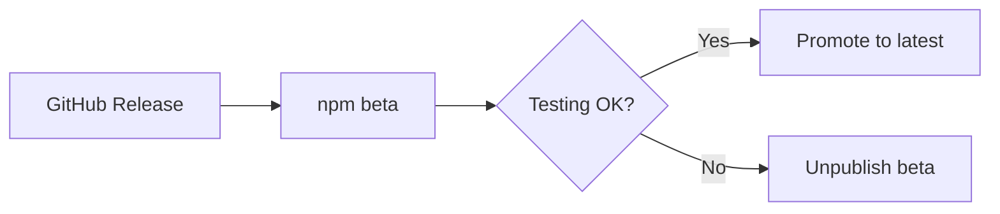

# 📦 npm Publishing Strategy Guide

A comprehensive guide for safely publishing Rust binaries to npm registry using the unified rust-release workflow.

## 🎯 Overview

This guide covers how to use the unified rust-release workflow to publish your Rust binaries as npm packages, with special focus on **unpublish policies** and **safe deployment strategies**.

## 🚀 Quick Start with Unified Workflow

```yaml
name: Release with npm
on:
  push:
    tags: ['v*']

jobs:
  release:
    uses: xctions/rust-release/.github/workflows/rust-release.yml@v3
    with:
      enable-npm: true
      npm-package-name: 'my-cli'
      # npm-dist-tag auto-detected from release tag pattern
    secrets:
      GITHUB_TOKEN: ${{ secrets.GITHUB_TOKEN }}
      NPM_TOKEN: ${{ secrets.NPM_TOKEN }}
```

## 🎯 Smart Tag Auto-Detection

The unified workflow automatically detects the appropriate npm dist-tag from your GitHub release tag:

### Auto-Detection Rules

| Release Tag | npm dist-tag | Use Case |
|-------------|--------------|----------|
| `v1.0.0` | `latest` | Production release |
| `v1.0.0-beta.1` | `beta` | Beta testing |
| `v1.0.0-alpha.1` | `alpha` | Alpha testing |
| `v1.0.0-rc.1` | `rc` | Release candidate |
| `v1.0.0-dev.1` | `dev` | Development build |

### How It Works

```bash
# The workflow checks your release tag pattern:
if [[ "$RELEASE_TAG" == *"-alpha"* ]]; then
  NPM_DIST_TAG="alpha"
elif [[ "$RELEASE_TAG" == *"-beta"* ]]; then
  NPM_DIST_TAG="beta"
elif [[ "$RELEASE_TAG" == *"-rc"* ]]; then
  NPM_DIST_TAG="rc"
elif [[ "$RELEASE_TAG" == *"-dev"* ]]; then
  NPM_DIST_TAG="dev"
else
  NPM_DIST_TAG="latest"
fi
```

### Override Auto-Detection

You can still override the auto-detection when needed:

```yaml
uses: xctions/rust-release/.github/workflows/rust-release.yml@v3
with:
  enable-npm: true
  npm-package-name: 'my-cli'
  npm-dist-tag: 'experimental'  # Override auto-detection
```

## ⚠️ npm Unpublish Policy

### Understanding npm's Restrictions

**Critical Fact: ALL versions (stable and prerelease) have IDENTICAL unpublish restrictions**

**Time-Based Restrictions:**
- **72 hours** for newly created packages (if no dependencies)
- **24-hour republish restriction** after complete package unpublish
- **Permanent reservation** of name@version combinations

**Dependency-Based Restrictions:**
- Cannot unpublish if ANY other package depends on it
- Registry immutability principle - once published, effectively permanent
- No difference between `1.0.0` and `1.0.0-beta.1` restrictions

**Why Prerelease Versions Seem "Safer":**
- ✅ **Lower visibility** - not installed by default
- ✅ **Explicit installation** required (`npm install pkg@beta`)
- ✅ **Mistake prevention** - won't accidentally become `latest`
- ❌ **NOT easier to unpublish** - same 72-hour/dependency rules apply

## 🏷️ npm Tag System Deep Dive

### System Tags

| Tag | Purpose | Install Command | Risk Level |
|-----|---------|----------------|-------------|
| `latest` | Default stable release | `npm install pkg` | 🔴 Very High (default install) |
| `beta` | Beta testing | `npm install pkg@beta` | 🟡 Medium (visible, commonly used) |
| `alpha` | Alpha testing | `npm install pkg@alpha` | 🟡 Medium (visible, commonly used) |
| `rc` | Release candidates | `npm install pkg@rc` | 🟡 Medium (visible, commonly used) |
| `dev` | Development builds | `npm install pkg@dev` | 🟢 Low (experimental, unstable) |
| `experimental` | Experimental features | `npm install pkg@experimental` | 🟢 Low (custom, less visible) |

**Note**: Unpublish restrictions are IDENTICAL for all tags. Risk level refers to impact of mistakes, not unpublish difficulty.

### Custom Tags (Recommended for Safety)

```bash
# Create your own safe tags
npm publish --tag canary
npm publish --tag nightly
npm publish --tag preview
npm publish --tag testing
```

**Benefits of Custom Tags:**
- **Lower visibility** = reduced mistake impact
- **Same unpublish restrictions** but less user exposure
- **Clear separation** from production environments
- **Explicit user intent** required for installation

## 🚀 Safe Deployment Strategies

### Strategy 1: Beta-First Approach (Recommended)



**Implementation:**
```yaml
# Create beta release tag (auto-detected)
git tag v1.0.0-beta.1  # → npm-dist-tag: beta
```

**Promotion Process:**
```bash
# After validation, promote to latest
npm dist-tag add my-package@1.2.3-beta.0 latest
```

### Strategy 2: Staged Release Pattern

```yaml
# GitHub Tag Pattern → npm Version & Tag
v1.2.3-alpha    → 1.2.3-alpha.0  (@alpha)
v1.2.3-beta     → 1.2.3-beta.0   (@beta) 
v1.2.3-rc       → 1.2.3-rc.0     (@next)
v1.2.3          → 1.2.3-beta.0   (@beta)    # Safe first
v1.2.3-stable   → 1.2.3           (@latest) # Direct stable
```

### Strategy 3: Date-Based Prerelease

```yaml
# Time-based versions for maximum safety
1.2.3-dev.20231201    (@dev)
1.2.3-beta.20231205   (@beta)
1.2.3                 (@latest)
```

## 🔧 Workflow Implementation

### Basic npm Publishing Workflow

```yaml
name: npm Publish

on:
  release:
    types: [published]

jobs:
  rust-release:
    uses: xctions/rust-release/.github/workflows/reusable-rust-release.yml@v2
    with:
      binary_name: 'my-cli'
      release-tag: ${{ github.ref_name }}
    secrets:
      GITHUB_TOKEN: ${{ secrets.GITHUB_TOKEN }}

  release:
    uses: xctions/rust-release/.github/workflows/rust-release.yml@v3
    with:
      enable-npm: true
      npm-package-name: 'my-cli'
      # npm-dist-tag auto-detected from release tag
    secrets:
      NPM_TOKEN: ${{ secrets.NPM_TOKEN }}
```

### Advanced Conditional Publishing

```yaml
release:
  uses: xctions/rust-release/.github/workflows/rust-release.yml@v3
  with:
    enable-npm: true
    npm-package-name: 'my-cli'
    # Override auto-detection for special cases
    npm-dist-tag: ${{ 
      contains(github.ref_name, 'experimental') && 'experimental' || 
      '' # Empty string uses auto-detection
    }}
  secrets:
    NPM_TOKEN: ${{ secrets.NPM_TOKEN }}
```

## 📋 Tag Mapping Reference

### Conservative Mapping (Safest)

| GitHub Release | npm Version | npm Tag | Risk Level |
|---------------|-------------|---------|------------|
| `v1.2.3` | `1.2.3-beta.0` | `beta` | 🟢 Low |
| `v1.2.3-dev` | `1.2.3-dev.0` | `dev` | 🟢 Very Low |
| `v1.2.3-alpha` | `1.2.3-alpha.0` | `alpha` | 🟢 Low |
| `v1.2.3-stable` | `1.2.3` | `latest` | 🔴 High |

### Aggressive Mapping (After Confidence)

| GitHub Release | npm Version | npm Tag | Risk Level |
|---------------|-------------|---------|------------|
| `v1.2.3` | `1.2.3` | `latest` | 🔴 High |
| `v1.2.3-beta` | `1.2.3-beta.0` | `beta` | 🟢 Low |
| `v1.2.3-alpha` | `1.2.3-alpha.0` | `alpha` | 🟢 Low |
| `v1.2.3-dev` | `1.2.3-dev.0` | `dev` | 🟢 Very Low |

## 🛡️ Best Practices

### 1. Start Conservative
```yaml
# Initial releases - always use beta
npm_dist_tag: 'beta'
```

### 2. Validate Before Promoting
```bash
# Test the beta version thoroughly
npm install my-package@beta
my-package --version
my-package --help

# If all good, promote
npm dist-tag add my-package@1.2.3-beta.0 latest
```

### 3. Use Semantic Versioning
```yaml
# Clear version progression
1.0.0-alpha.1
1.0.0-alpha.2  
1.0.0-beta.1
1.0.0-rc.1
1.0.0          # Final
```

### 4. Monitor Downloads
```bash
# Check tag usage
npm view my-package dist-tags
npm view my-package versions --json
```

## 🚨 Emergency Procedures

### If You Need to Unpublish

**Within 72 hours (new packages only):**
```bash
# Only if no other packages depend on it
npm unpublish my-package@1.2.3
```

**After 72 hours or if dependencies exist:**
```bash
# npm support rarely grants unpublish requests
# Use deprecation instead - much more practical
npm deprecate my-package@1.2.3 "This version has critical issues - use @1.2.4"
```

**Important**: There are NO special unpublish rules for prerelease versions. All versions follow the same 72-hour/dependency restrictions.

### Alternative: Deprecation
```bash
# Safer than unpublish
npm deprecate my-package@1.2.3 "Please use @1.2.4 instead"
```

## 📊 Package Structure

### Binary Wrapper Pattern

```json
{
  "name": "my-rust-cli",
  "version": "1.2.3-beta.0",
  "bin": {
    "my-cli": "./bin/my-cli"
  },
  "scripts": {
    "postinstall": "node download-binary.js"
  },
  "files": [
    "bin/",
    "download-binary.js"
  ]
}
```

### Download Script Pattern

```javascript
// download-binary.js
const { execSync } = require('child_process');
const os = require('os');

const platform = process.platform;
const arch = process.arch;
const version = process.env.npm_package_version;

// Map to GitHub Release assets
const assetName = `my-cli-${platform}-${arch}${platform === 'win32' ? '.exe' : ''}`;
const downloadUrl = `https://github.com/owner/repo/releases/download/v${version}/${assetName}`;

// Download and install binary
```

## 🔗 Integration Examples

### Frontend Tool Integration

```json
{
  "name": "my-frontend-project",
  "devDependencies": {
    "my-rust-cli": "^1.2.3"
  },
  "scripts": {
    "build": "my-cli build --optimize",
    "format": "my-cli format src/"
  }
}
```

### CI/CD Pipeline

```yaml
- name: Install Rust CLI tool
  run: npm install -g my-rust-cli@beta

- name: Use tool in build
  run: my-cli process --input src/ --output dist/
```

## 📈 Migration Path

### Phase 1: Testing (Recommended Start)
- All releases → `beta` tag
- Manual promotion to `latest` after validation
- Build confidence in the system

### Phase 2: Semi-Automatic
- Stable branches → `latest` tag
- Feature branches → `beta` tag
- Automated based on branch patterns

### Phase 3: Full Automation (After Confidence)
- Direct publishing to appropriate tags
- Comprehensive testing in CI before npm publish
- Automated rollback procedures

## 🎯 Success Metrics

### Track These KPIs
- **Unpublish incidents**: Should trend to zero
- **Download ratios**: `latest` vs `beta` vs other tags
- **User feedback**: Issues related to npm installation
- **Adoption rate**: npm installs vs GitHub releases

This strategy ensures safe, reliable npm publishing while maintaining the flexibility to fix issues when needed.